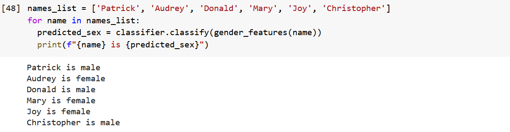

# 66daysofdata_NLP

## Resources

### Books
- [Natural Language Processing with Python](https://www.nltk.org/book/)

# Day 1 of 66daysofdata

On my journey of #66daysofdata, I decided to start with the basics of Natural Language Processing (NLP). Today, I started with familiarizing myself with the NLTK library as well as some of the fundamental vocabularies (tokens, types, and lexical richness). **Tokens** are the number of characters in a text. **Types** are distinct and unique tokens in a text while **lexical richness** is the percentage of distinct tokens in a text. See you again tomorrow!

Book:
[Chapter 1. Natural Language Processing with Python](https://www.nltk.org/book/)

# Day 2 of 66daysofdata

Today, I touched on the overview of NLP usecase, including speech recognition, machine translation, and textual entailment. I also learned that NLP still has a lot of limitations such as performing common-sense reasoning or drawing on world knowledge to perform tasks. Here's is my image of the day. It explains the spoken dialog system pipeline. Now I have a high level understanding of how my Google Assistant works! Can't wait for tomorrow!

Book:
[Chapter 1. Natural Language Processing with Python](https://www.nltk.org/book/)

# Day 3 of 66daysofdata

I continued my journey by learning about WordNet and semantic similarity. WordNet is a lexical database of English words and their meaning. This is very useful in finding how close/similar two words are to each other by calculating their semantic similarity, which takes values 0 to 1, and the more similar are the closer to 1 their semantic similarity will be. Below is the calculated semantic similarity between the words "car" and "vehicle". Excited to learn more about how this concept is applied to a real-world NLP task. See you tomorrow!

Book:
[Chapter 2. Natural Language Processing with Python](https://www.nltk.org/book/)

# Day 4 of 66daysofdata

Tokenization! This is a very important text pre-processing step in any NLP task. Tokenization is the process of breaking a text into a list of tokens (words and punctuations). I also learned how to parse HTML texts using BeautifulSoup. I practiced today's lesson by extracting the text from my latest blog post, parsing the HTML, extracting the text, and tokenizing it. See image below for the result.

Book:
[Chapter 2. Natural Language Processing with Python](https://www.nltk.org/book/)

# Day 5 of 66daysofdata

My next lesson was about data normalization, which includes stemming and lemmatization. Stemming is a process of reducing a word to its root by removing the affixes, while lemmatization reduces the word to its base form but making sure the resulting word has a meaning. I am yet to be acquainted with this process, so I will have to practive a bit more in the coming days. I also deviated from NLP a bit and practiced web scrapping using Requests and BeautifulSoup libraries. 

Book:
[Chapter 3. Natural Language Processing with Python](https://www.nltk.org/book/)

# Day 6 of 66daysofdata

Ever wondered how outlook email or gmail completes a sentence like "I am looking forward to...."? Today, I read about N-grams. These are basically a sequence of n items in a given text or speech. According to the word that came before, the algorithm predicts which word has the highest probability of following. Multiple N-grams (like bigrams and above) are able to capture the context of which words are likely to follow the sequence either in speech or text. 

Book:
[Chapter 3. Natural Language Processing with Python](https://www.nltk.org/book/)

# Day 7 of 66daysofdata

Today was my weekly revision day and I revised concepts like tokenization, stemming, lemmatization, and string formatting. I also touched on Regular expressions and how to use them to extract some information from a text. Been a great week so far and I am excited for the days ahead. 

Book:
[Chapter 3. Natural Language Processing with Python](https://www.nltk.org/book/)

# Day 8 of 66daysofdata

Today I read the fourth chapter of the NLP with Python book and talks about the fundamentals of writing good structure programs. I revised list comprehensions, mutable and immutable objects, and how to optimize your code using declarative programming.

Book:
[Chapter 4. Natural Language Processing with Python](https://www.nltk.org/book/)

# Day 9 of 66daysofdata

Today, I read about Part-of-Speech Tagging, which is a process of categorizing words in correspondence with their part of the speech (e.g. verb, noun, adverb...) according to their meaning and their context in a sentence. Reading more about this process tomorrow!

Book:
[Chapter 4. Natural Language Processing with Python](https://www.nltk.org/book/)

# Day 10 of 66daysofdata

In today's learning, I started a new chapter on classifying text. I read about **Multi-class classification** which is when a text input has multiple labels, **Open-class classification**, which is a case where a set of labels is not defined in advance and **Sequence classification** which is when a list of inputs are jointly classified. From here I focused on supervised classification where I practiced by training a model to classify sex by name using Naive Bayes Classifier. 

Book:
[Chapter 6. Natural Language Processing with Python](https://www.nltk.org/book/)

 

# Day 11 of 66daysofdata

Today, I kept my practice on Naive Bayes classification along with a slight introduction to Decision trees. I also learned how that you can make sure you reduce bias (or oversampling) in your model by not only reserving a test set but also a development test set. The dev test is used to develop a list of errors the model made in the classification, which in turn can be used to improve the features supplied to the model and improve its accuracy. 

Book:
[Chapter 6. Natural Language Processing with Python](https://www.nltk.org/book/)

